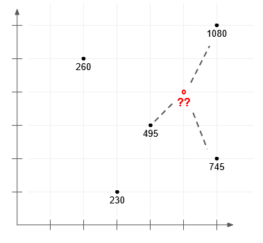

# HW3 - Exceptions and Testing

0. Create two directories at the base directory of the homework repository: `src` and `tests`.

### Create a module in the `src` folder named `knn.py`.

1. Inside `knn.py`, write a function, `knn_regression(n_neighbors, data, query)` that implements the k-Nearest Neighbors algorithm for regression. (2 pts for algorithm, 1 pt for exceptions)

The algorithm takes a parameter `k`, or `n_neighbors`, along with the dataset (2 dimensional numpy array, shape (m,**n+1**)), labels for that dataset (2 dimenand query data point (1 dimensional numpy array, shape (n,)). The algorithm returns the predicted value for query, a single numeric value, or raises an appropriate exception (such as `ValueError`) when inappropriate inputs are passed.

We are not grading your homework based on computational complexity or on dimensionality larger than 4, so don't worry about inefficient algorithms.

Note that the creation of data to test your function is up to you. Other than the example below, we do not provide a dataset.

### Example inputs and outputs

```
import numpy as np

n_neighbors = 3
data = np.array([[3, 1, 230],
                 [6, 2, 745],
                 [6, 6, 1080],
                 [4, 3, 495],
                 [2, 5, 260]])

query = np.array([5, 4])

knn_regression(n_neighbors, data, query)  # returns 773.33
```

This is a visualization of the example inputs.



### Pseudocode for kNN Regression

A. Load the data

B. Initialize K to your chosen number of neighbors

C. For each example in the data:

C.1 Calculate the distance between the query example and the current example from the data

C.2 Add the distance and the index of the example to an ordered collection

D. Sort the ordered collection of distances and indices from smallest to largest (in ascending order) by the distances

E. Pick the first K entries from the sorted collection

F. Get the labels of the selected K entries

G. Return the mean of the K labels

### Create a Python module `test_knn.py` inside the `tests` folder.

2. Inside `test_knn.py`, write a series of test cases to confirm the validity of your implementation in part #1. These tests should contain:

a. At least one *smoke* test (1pt).

b. At least two *one-shot* tests (1pt).

c. All appropriate *edge* tests you find useful for the algorithm (at least two) (2 pts).
